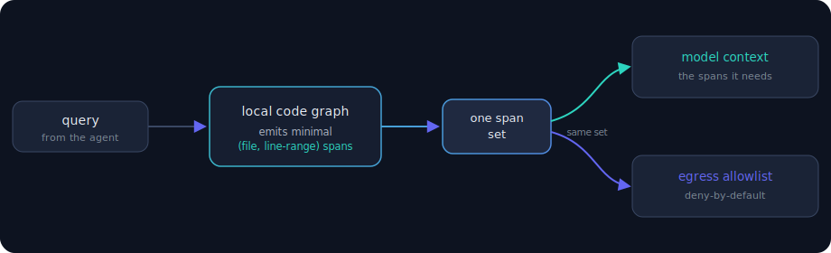
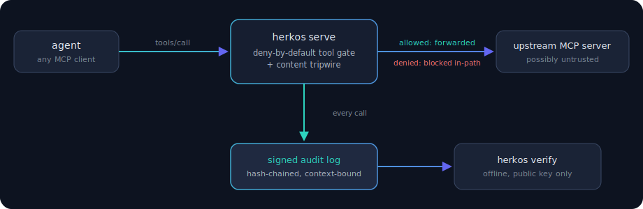

# Herkos

[](https://github.com/akhilesharora/herkos/actions/workflows/ci.yml) · [](https://codecov.io/gh/akhilesharora/herkos) · [](https://goreportcard.com/report/github.com/akhilesharora/herkos) · [Live site](https://akhilesharora.github.io/herkos/) · Apache-2.0

A local-first, pure-Go in-path MCP egress broker. Herkos sits between an AI agent and the MCP servers it calls, gates which tool calls reach upstream on the wire, and writes a signed, offline-verifiable audit log of every brokered call. It is built around **SpanGate**: the minimal code context an agent needs to answer a query is exactly the set it should be allowed to send back out. It is a working utility you can read, run, and verify.

## SpanGate
For each query, Herkos's local tree-sitter code graph emits a minimal set of `(file, line-range)` spans. That same set is both the model's context (fewer tokens) and the egress allowlist (deny-by-default). The dual-use is structural: a single `core.Binding` is the only value both the serve path and the egress authorizer read, so "the context set and the egress set are identical" is a type invariant, not a convention two code paths politely agree to. Every answer ships a signed Merkle receipt, verifiable offline by a third party with only the public key.



The live broker (`herkos serve`) enforces that same set on the wire:



## Install / Use it with your agent
Herkos presents as an MCP server to whatever launches it and forwards to the real one, so it works in front of any MCP client with no client-specific code. Wrapping a server is one config change: point the client's `command` at `herkos serve` and pass the real command after `--`.

First, generate the local signing key (stays on your machine, `0600`):
```
herkos keygen
```

The fastest path is to broker everything you already have. `register --all` walks a config and wraps every local stdio server in place:
```
herkos register --all --config .mcp.json
```
It launches each server once to discover the tools it exposes, then pins exactly those tools as the server's allowlist, so a tool added by a later upstream update is denied by default. Remote servers and entries already brokered through Herkos are skipped.

`scan` and `register` work across any client by config **shape**, not by client name. They auto-detect both JSON launch-config shapes, the `mcpServers` object and the `servers` object, so the same two commands cover Claude Code, Cursor, VS Code, GitHub Copilot, Cline, Windsurf, and anything else using either shape. Codex stores its servers as TOML in `~/.codex/config.toml`; that one is the same one-line wrap, hand-edited for now, since `register` does not rewrite TOML yet.

Wrap a single server in place instead of the whole config:
```
herkos register --config .mcp.json --server github --allow-tool get_issue --allow-tool list_issues
```

Or skip the config and broker an upstream server directly. The agent's MCP client launches `herkos serve ...`; everything after `--` is the upstream server command:
```
herkos serve --allow-tool read_file --allow-tool list_dir -- npx -y @some/mcp-server
```
A `tools/call` to any tool you did not `--allow-tool` is blocked in-path and answered with a JSON-RPC error; the agent's session keeps running.

## What works
The pure-Go SpanGate core (SELECT -> Binding -> canonicalize -> pool -> signed receipt, with the dual-use leak provably blocked), the tree-sitter parser (Go/TS/Python), the on-disk index, the CLI, and the live in-path MCP broker (`herkos serve`, MCP newline-framed and verified end to end over real stdio framing against a subprocess) all work and are tested under the race detector, fuzzed, and gated on a clean-checkout build. The run against a third-party MCP server (`@modelcontextprotocol/server-everything`) is a manual repro, in the [reproduce-it-yourself](#reproduce-it-yourself) steps below, not in CI.

Enforcement is described plainly, because a security tool that hides its gaps is worse than none:

- The broker's **default egress guard is tool-name only**. It gates which `tools/call` reach the upstream, not payload bytes or other methods.
- Pinning a served set (`--served-span` with `--index`) adds a **content tripwire** that blocks tool-call arguments carrying repo lines from outside the set, after normalizing case and whitespace so a reflow or recase still trips. This is a userspace heuristic that base64, paraphrase, or token rewrite still defeat. It is not an airtight boundary.
- `serve --receipts <dir>` keeps a **signed, hash-chained audit log** of every brokered tool call, fail-closed: an audit-write failure stops the session rather than letting an unlogged call through. `herkos verify` detects any edit, reorder, or mid-drop offline with only the public key, and reports a truncated log (one missing its signed close) as incomplete. With a served set pinned, the opening record commits a fingerprint of that served context, so the receipt proves which context-egress binding was in force.
- `serve --isolate` runs a server in a **kernel network namespace with no route out** (unprivileged, Linux), so a server that only needs stdio to Herkos cannot open its own socket to any host. The transformation-resistant, full per-destination egress seal (eBPF host allowlisting) is **not built**.

The signed receipt is the one durable, distinctive piece, and it works today.

## Reproduce it yourself
Broker a real MCP server, deny a tool in-path, and verify the signed receipt offline. `echo` is allowed, any other `tools/call` is blocked in-path:
```
herkos keygen
herkos serve --allow-tool echo --receipts /tmp/r -- npx -y @modelcontextprotocol/server-everything
herkos verify --file /tmp/r/<session>.jsonl --pubkey <public-key>   # VERIFIED ... cleanly closed
```
Editing a record, dropping the sealed last line, or using a different public key all make `herkos verify` fail (INCOMPLETE for a chopped log, a hard failure otherwise).

Arm the content tripwire by building an index and pinning the spans the model may see. A tool-call argument carrying a repo line from outside `auth.go:1-40` is then blocked on a normalized match, and the served set is bound into the receipt:
```
herkos index .
herkos serve --allow-tool read_file --index .herkos/index --served-span auth.go:1-40 \
  --receipts /tmp/r -- npx -y @some/mcp-server
# the receipt's opening record commits a fingerprint of the served set; flipping it fails verify
```

Add `--isolate` to cut the server's own network (Linux). On shutdown the log is sealed and its tip hash printed, so a later truncation is detectable:
```
herkos serve --allow-tool read_file --receipts ~/.herkos/audit --isolate -- npx -y @some/mcp-server
herkos verify --file ~/.herkos/audit/<session>.jsonl --pubkey <hex>   # VERIFIED, or INCOMPLETE if chopped
```

## Where it stands
Market and threat analysis (see [`CASE-STUDIES.md`](docs/CASE-STUDIES.md) for worked examples against real 2025 MCP incidents) puts three of the four pillars in commodity territory:

- **Native host tool allow/deny.** Claude Code, Cursor, and VS Code Copilot ship deny-by-default MCP allowlists and OS-level network sandboxes, enterprise-managed. The in-path tool-name broker lives in their lane.
- **Signed offline-verifiable receipts.** Open-source **Pipelock** is a strict superset: Ed25519 hash chain covering MCP stdio *and* HTTP, with a non-Go verifier. Herkos has one format and one verifier. Do not read Herkos as doing more here than Pipelock does.
- **Admission scanning.** Snyk's / Invariant's `mcp-scan` detects tool-poisoning by content analysis with no baseline; Herkos's `scan` only flags tool-description drift against a trusted baseline, so it misses first-seen poisoning.

The threat shape is honest about reach too: the marquee MCP attacks (GitHub toxic-agent-flow, `postmark-mcp`) ride *approved* tools or leak server-side. An in-path broker cannot prevent them. What it delivers is **harm-reduction and forensics**, a tighter blast radius and a verifiable record of what happened, not prevention.

That is the scope, not a verdict. Inside it, one piece is distinct: **context-derived egress as a type invariant**, the SpanGate dual-use binding done in a shipping product. It is distinct in a shipping product, not new as an idea: the concept is anticipated in the research (CaMeL, OCELOT, NeuroTaint), and the enforcement today is the defeatable content tripwire, not an airtight boundary. The honest account of why it differs from IFC and signed-receipt work, and exactly where it holds and does not, is in [`DUAL-USE-BINDING.md`](docs/DUAL-USE-BINDING.md). The field map, on three axes against Pipelock, capgate, mcp-spine, mcp-scan, and srt, is in [`COMPARISON.md`](docs/COMPARISON.md).

## Develop
```
make build         # go build ./...
make race          # go test ./... -race
make lint          # golangci-lint run
make check         # build + vet + race + lint
make verify-clean  # build + vet + race the committed code, not the working tree
```

## Write-up
The honest account of why it was built, why prevention is not achievable, and where it does work is in [WRITEUP.md](docs/WRITEUP.md).

## License
Apache-2.0.
